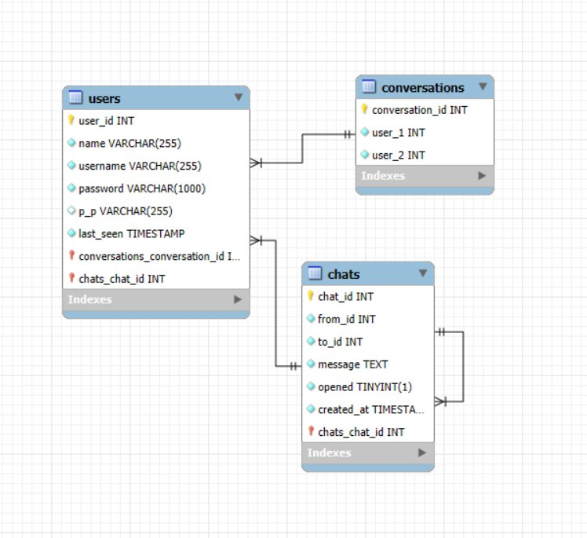
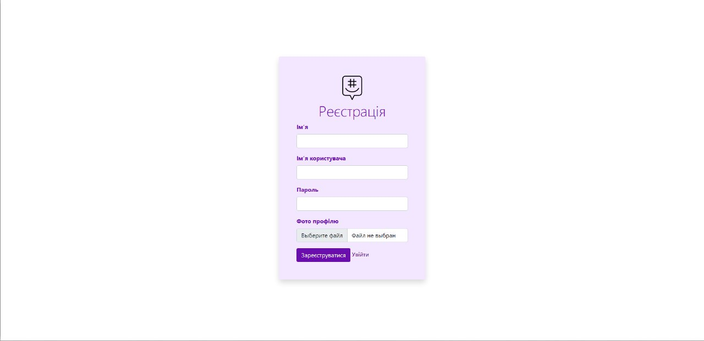
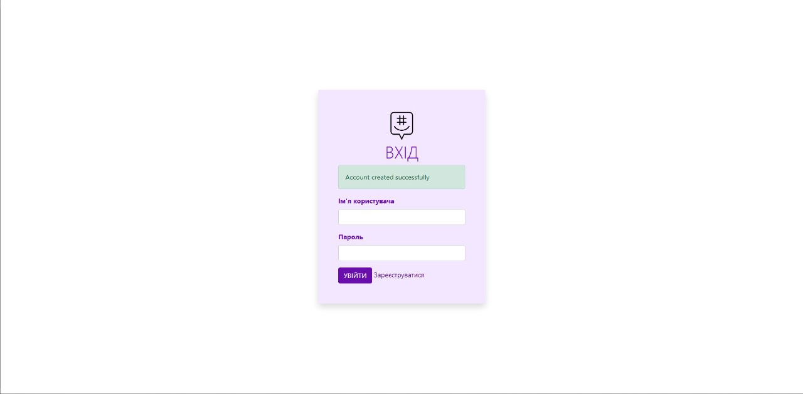
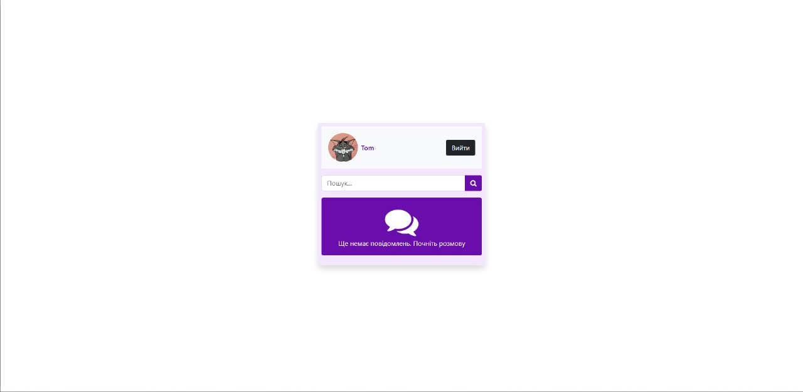
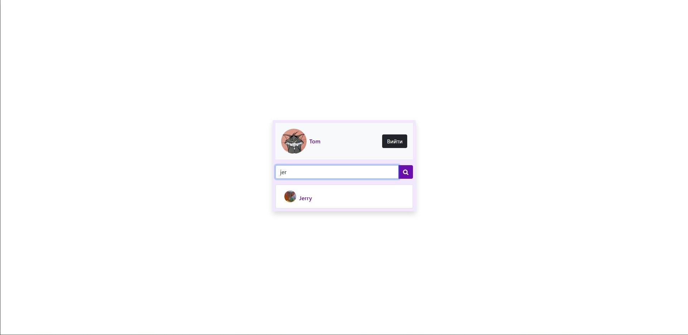
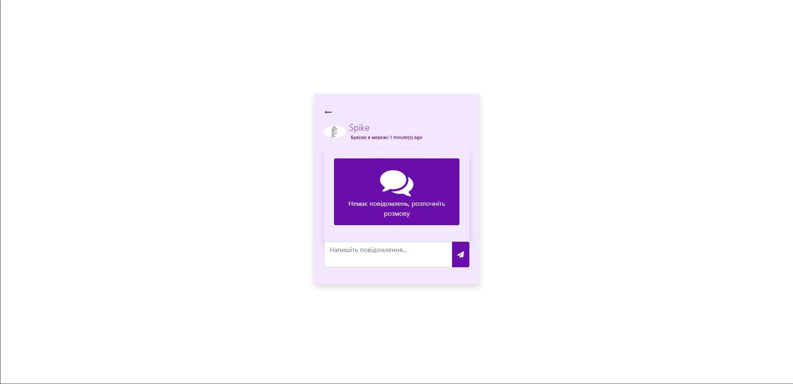
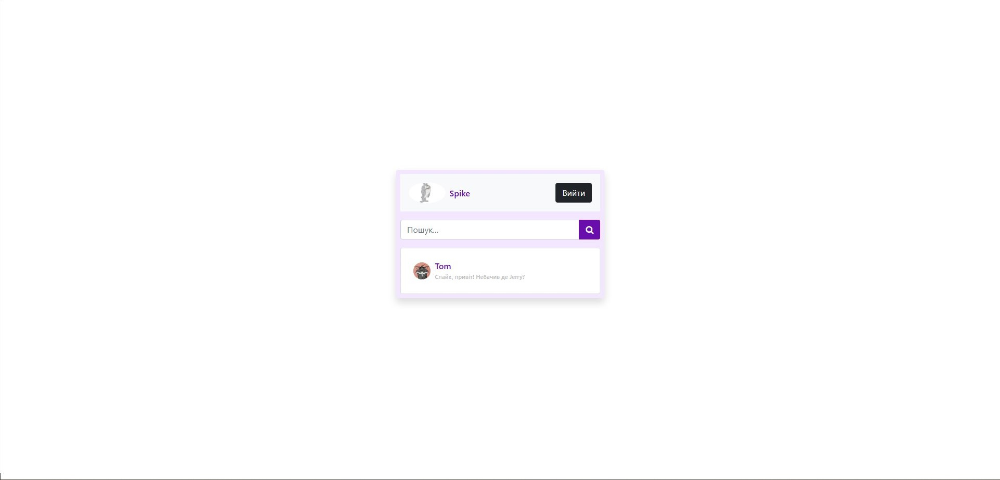
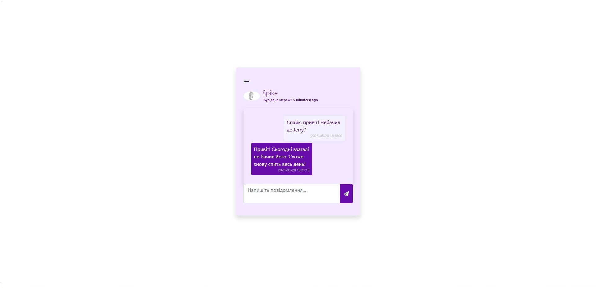
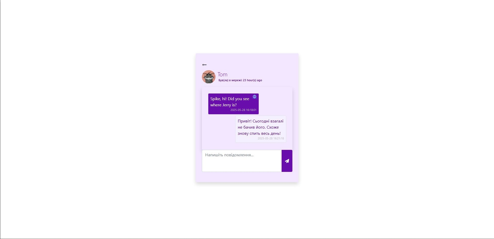

# Chat-app-PHP-MySQL-AI-Translation

A simple real-time chat application built with PHP and MySQL.  
It includes AJAX-based messaging, user system, conversations, online status, and AI-powered message translation.

---

## Development Tools


---

## Technologies


---

## Features

- User registration & login system
- Private one-to-one chats
- Real-time messaging using AJAX polling
- User search functionality
- Online / last seen status
- Message read tracking (opened status)
- Message translation (MyMemory API)
- Profile picture upload
- Responsive UI using Bootstrap 5

---

## Screenshots

### DB


### Registration Page


### Account Created


### Main Page


### Search


### Chat Page


### Message Received


### Chatting


### Message translation support


## Installation

1. Clone repository

```
git clone https://github.com/BorysDudnyk/Chat-app-PHP-MySQL-AI-Translation
```

2. Move project folder to OpenServer domains directory

3. Import database from `chat.sql`

4. Configure database connection in:

```php
config/db.php
```

5. Start OpenServer and open project in browser
